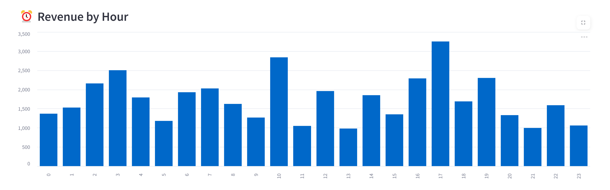
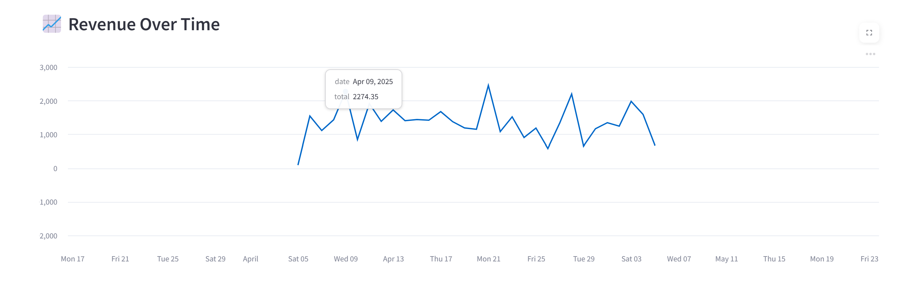

# 📊 SalesPulse – Real-Time Sales Analytics Dashboard

A complete end-to-end project that simulates retail sales data, processes it using Python, analyzes it with pandas and visualization libraries, and displays real-time business insights through an interactive dashboard built with **Streamlit**.

---

## 🚀 Live Demo

👉 [Click here to view the live dashboard](https://salespulse-dashboard-rnumfr8kx9qwk2c5a4zm4k.streamlit.app)


---

## 🛠️ Features

- ✅ Simulated sales data using Faker
- ✅ Cleaned and loaded into SQLite and pandas
- ✅ Exploratory Data Analysis (EDA) using matplotlib/seaborn
- ✅ Interactive dashboard with Streamlit
- ✅ Filters for Category and Payment Method
- ✅ KPIs: Total Revenue, Total Orders, Avg Order Value
- ✅ Visuals: Time trends, top products, sales by hour

---

## 📊 Sample Visuals

### 🖼️ Dashboard Preview

- **Revenue by Hour of Day**



- **Revenue Over Time**

  

- **Top Products by Revenue**
  


Dataset
Generated with Faker

Fields include:

timestamp, product_id, product_name

category, quantity, price, payment_method

Computed fields: total, hour, weekday

📚 Tech Stack
Layer	Tools
Data Generation	Python, Faker
ETL & Analysis	Pandas, SQLite
Visualization	Matplotlib, Seaborn
Dashboard	Streamlit
Hosting	Streamlit Cloud
Version Control	Git, GitHub

💡 Key Insights
Peak sales occur between 12–2 PM and 6–8 PM

Electronics is the highest revenue category

Bluetooth Headphones is the top-selling product

Most transactions use Credit Card or PayPal

Sales dip on Sundays — a potential marketing opportunity


## 📦 How to Run Locally

```bash
# 1. Clone the repo
git clone https://github.com/yourusername/salespulse-dashboard.git
cd salespulse-dashboard

# 2. Install dependencies
pip install -r requirements.txt

# 3. Run the Streamlit app
streamlit run app.py
  
